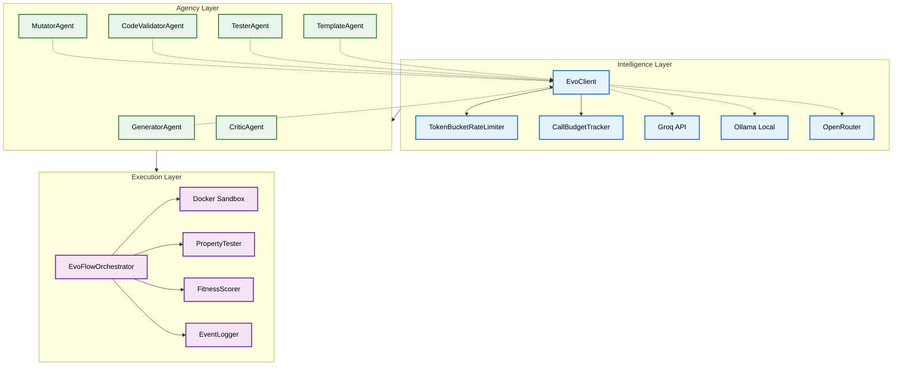
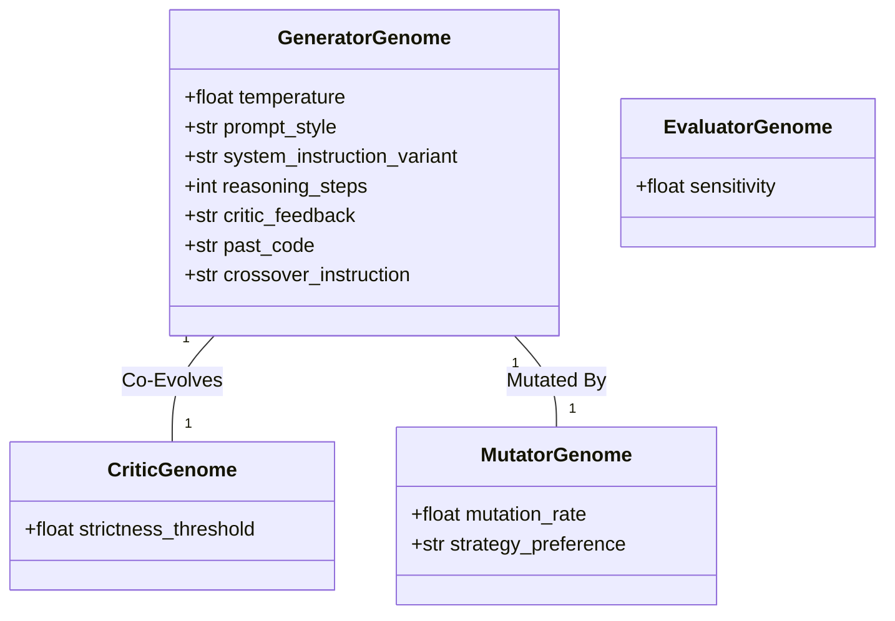
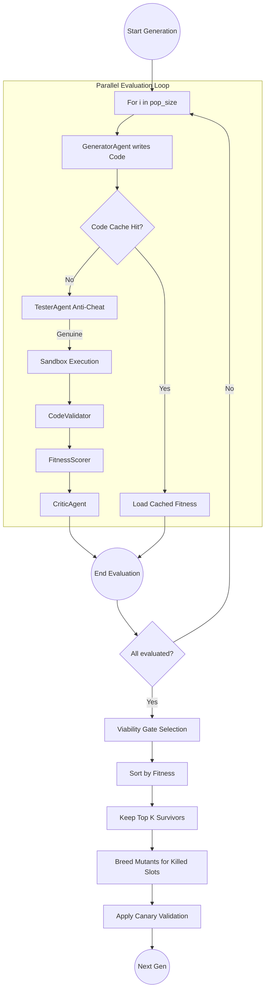
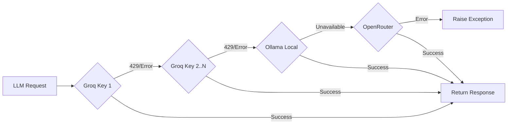

# 🏛️ EvoCode Architecture Deep Dive

This document provides a highly detailed architectural overview of the **EvoCode** system. It explores the internal mechanics of the 3-Tier LLM Client, the Secure Docker Sandbox, the Co-Evolutionary Agent framework, and the overarching EvoFlow Orchestrator.

---

## 📑 Contents
1. [High-Level Architecture](#high-level-architecture)
2. [The 4-Layer Evaluation Hierarchy](#the-4-layer-evaluation-hierarchy)
3. [The Co-Evolutionary Agent Framework](#the-co-evolutionary-agent-framework)
4. [EvoFlow Orchestrator (The Engine)](#evoflow-orchestrator)
5. [Secure Sandboxing System](#secure-sandboxing-system)
6. [3-Tier Resilient LLM Client](#3-tier-resilient-llm-client)
7. [Telemetry and Data Flow](#telemetry-and-data-flow)

---

## 🏗️ High-Level Architecture

EvoCode is fundamentally an orchestration of smaller, specialized systems working in tandem to produce, verify, and improve software. The architecture can be broadly divided into three main operational domains:

1. **The Intelligence Layer:** Consists of the LLM Client, Rate Limiters, and the API providers (Groq, Ollama, OpenRouter).
2. **The Agency Layer:** Contains the specialized AI personas (`GeneratorAgent`, `CriticAgent`, `MutatorAgent`, `ValidatorAgent`, `TesterAgent`).
3. **The Execution Layer:** The isolated Docker sandbox, `PropertyTester`, and `FitnessScorer`.

---

## 🗺️ The 4-Layer Evaluation Hierarchy

The system enforces a rigorous 4-layer evaluation protocol to ensure code correctness and robustness:

1. **Layer 1: The Base Tests**
   - The predefined static input/output test cases provided in the JSON problem definition.
2. **Layer 2: Property-Based Ephemeral Tests**
   - The `PropertyTester` dynamically generates random inputs on the fly (e.g., extremely large numbers, empty strings, negative boundaries) and appends them to the sandbox execution queue. This prevents the LLM from simply overfitting to Layer 1.
3. **Layer 3: Multiplicative Fitness & Viability Gate**
   - **Layer 3A (Viability Gate):** If a generated solution fails *every single test*, it is completely eliminated from the breeding pool. It provides no correctness signal.
   - **Layer 3B (Multiplicative Fitness):** The `FitnessScorer` calculates a score using the formula `Correctness Rate × Quality Score`. Correctness is objective (passed / total). Quality is subjective (AST complexity, cyclomatic complexity heuristics).
4. **Layer 4: Held-Out Evaluation (Validation)**
   - The `CodeValidatorAgent` uses an LLM to logically verify the sandbox results. If the sandbox passed all tests but the Validator detects a logical flaw (e.g., an unhandled edge case the tests missed), it overrides the fitness.

---

## 🧬 The Co-Evolutionary Agent Framework

EvoCode models a genetic algorithm where the "DNA" is the prompt engineering configuration. Each agent is driven by a Pydantic "Genome".

### The Genomes

### Agent Behaviors
- **TemplateAgent:** Runs *once* before the generation cycle begins. It analyzes the problem and writes a language-specific scaffold/skeleton (e.g., defining `class Solution { public int solve(int[] nums) { ... } }`).
- **GeneratorAgent:** Takes the scaffold, the problem description, and the `GeneratorGenome`. Its sole job is to inject the algorithmic body into the scaffold based on its genome settings (e.g., if `prompt_style == "chain_of_thought"`, it reasons heavily before writing code).
- **CriticAgent:** A purely rule-based agent. It looks at the JSON array returned by the Sandbox. If a crash occurred, it flags `severity = 1.0` and recommends `add_error_handling`. If it timed out, it recommends `simplify_logic`.
- **MutatorAgent:** The evolutionary driver. It uses an LLM to read the Critic's diagnosis and the parent's genome, proposing a child genome. For example, if a loop timed out, the Mutator might decrease the `temperature` and switch the `prompt_style` to `step_by_step`.

---

## ⚙️ EvoFlow Orchestrator

The `EvoFlowOrchestrator` (`src/evoflow.py`) is the master loop. It manages the lifecycle of the populations.

### The Evolution Cycle Workflow

### Crossover (Knowledge Sharing)
A unique architectural feature is cross-language pollination. The Orchestrator tracks the absolute best fitness across all languages. When breeding a new C++ child, the `MutatorAgent` can inject the successful Python source code into the C++ child's `crossover_instruction`, asking it to translate the underlying strategy.

---

## 🔒 Secure Sandboxing System

Executing AI-generated code on a host machine is a severe security risk. EvoCode utilizes a strict Docker abstraction.

### `sandbox.py` Mechanics
1. **Harness Injection:** The sandbox does not just run raw code. It dynamically builds a JSON-driven testing harness.
    - For Python, it injects an `exec/eval` loop.
    - For Java, it injects a Reflection-based runner that dynamically discovers the `solve` method and maps JSON primitives to Java types.
    - For C++, it uses regex to determine the arity (number of arguments) of the generated function and compiles a hardcoded `nlohmann::json` dispatch loop.
2. **Docker Constraints:**
    - `--network none`: The container cannot access the internet (prevents data exfiltration or downloading malicious payloads).
    - `--memory 256m`: Hard memory limit to prevent fork bombs and memory exhaustion.
    - `--cpus 0.5`: CPU throttling.
    - `timeout=15`: Native python subprocess timeout to kill infinite loops (e.g., `while True:`).
3. **Telemetry Extraction:** The sandbox parses standard output for a JSON array. It extracts:
    - Time elapsed per test (ms).
    - Peak memory allocated per test (kb) via `tracemalloc` (Python), `Runtime.getRuntime()` (Java), or `getrusage` (C++).
    - Exception stack traces on crash.

---

## 🔌 3-Tier Resilient LLM Client

The `EvoClient` (`src/client.py`) is designed for maximum uptime and resilience during long-running evolutionary algorithms where thousands of LLM calls are made.

### The Fallback Strategy

### Rate Limiting & Budgeting
- **`TokenBucketRateLimiter`:** Tracks RPM (Requests Per Minute) and TPM (Tokens Per Minute). Uses asynchronous `asyncio.sleep` to smoothly delay requests before they hit the provider's 429 limits.
- **`CallBudgetTracker`:** Increments a global counter of API calls. If `TOTAL_CALL_BUDGET` is exceeded, it gracefully halts the system to prevent unexpected billing spikes.

---

## 📈 Telemetry and Data Flow

EvoCode is heavily instrumented. Data is written to two main sinks:
1. **`EventLogger`:** Formats and streams colorful, human-readable ASCII output to the terminal, allowing the user to watch the evolutionary battle live.
2. **Structured JSON Reports:** Everything (genomes, code, test traces, critique, mutations) is compiled into a massive JSON object in memory. At the end of a run, this is dumped into `structured_reports/ddmmyyyy_hh-mm-ss.json`. This format allows for downstream analysis, plotting, and the Layer 4 Held-Out Evaluation (`run_test_eval.py`) to extract the winning genomes.
