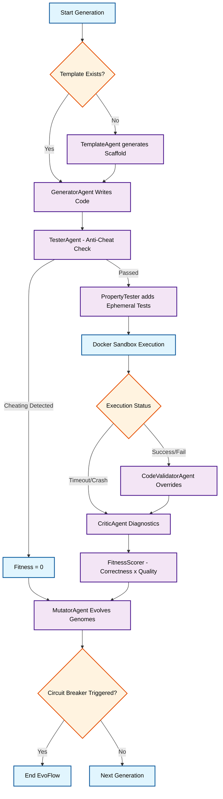

<div align="center">
  <h1>🧬 EvoCode</h1>
  <p><strong>A Co-Evolutionary AI Code Generation System</strong></p>
  <p>Multi-agent, multi-language, sandbox-secured code generation powered by genetic algorithms.</p>
</div>

---

## 📑 Table of Contents
1. [Introduction](#-introduction)
2. [Key Features](#-key-features)
3. [System Requirements](#-system-requirements)
4. [Installation & Setup](#-installation--setup)
5. [Usage Instructions](#-usage-instructions)
    - [Interactive Chat Mode](#interactive-chat-mode)
    - [Evaluation Mode](#evaluation-mode)
6. [Project Structure](#-project-structure)
7. [System Architecture Overview](#-system-architecture-overview)
8. [Evolutionary Agents](#-evolutionary-agents)
9. [Configuration (Environment Variables)](#-configuration)
10. [Troubleshooting & Logs](#-troubleshooting--logs)
11. [Future Work & Contributions](#-future-work--contributions)
12. [License](#-license)

---

## 🚀 Introduction

**EvoCode** is an advanced AI code generation system that moves beyond simple zero-shot prompting. By employing a **co-evolutionary multi-agent architecture**, EvoCode generates, tests, critiques, and mutates code solutions across multiple programming languages (Python, Java, C++) simultaneously.

Instead of relying on a single LLM call to get it right, EvoCode simulates a Darwinian process:
- A **population of Generator Agents** writes code based on distinct "genomes" (prompt styles, temperatures, system instructions).
- A **secure Docker Sandbox** executes the code against hidden and generated test cases to evaluate fitness.
- A **Critic Agent** diagnoses failures and recommends mutations.
- A **Mutator Agent** evolves the genomes for the next generation, cross-pollinating ideas between languages.

EvoCode is designed to solve complex programming puzzles that traditional single-shot LLM approaches fail at.

---

## ✨ Key Features

- 🌐 **Polyglot Code Generation:** Natively supports evaluating and evolving Python, Java, and C++ code within the same population.
- 🛡️ **Secure Docker Sandboxing:** All AI-generated code is executed in an isolated, network-disabled Docker container (`evocode-sandbox`) to prevent malicious activity.
- 🧬 **Co-Evolutionary Pipeline:** Genomes representing prompt engineering strategies evolve over generations based on a fitness score (correctness rate × code quality).
- 🧠 **Anti-Cheating Mechanisms:** The `TesterAgent` ensures the model doesn't just hardcode outputs to pass known test cases.
- 🔄 **3-Tier LLM Fallback Chain:** Robust API handling that tries Groq Cloud (rotating keys), falls back to Ollama (Local LLMs), and ultimately relies on OpenRouter if needed.
- 📊 **Comprehensive Telemetry:** Tracks peak memory usage, execution time (ms), pass/fail/crash rates, and saves detailed structured JSON reports for every run.
- 🚦 **Intelligent Circuit Breaker:** The system automatically halts the evolution process if a perfect solution (100% test pass rate) is discovered early, saving API tokens.

---

## 💻 System Requirements

To run EvoCode, your system must meet the following prerequisites:

1. **Operating System:** Windows 10/11, macOS, or Linux.
2. **Python:** Version 3.10 or higher.
3. **Docker Engine:** Docker Desktop (Windows/Mac) or Docker Daemon (Linux) MUST be installed and running.
4. **API Keys:**
   - Groq API Key (Primary LLM provider, extremely fast).
   - OpenRouter API Key (Optional, used as a cloud fallback).
5. **Local LLM (Optional but Recommended):** Ollama installed with a running model (e.g., `llama3` or `codellama`) for the local fallback tier.

---

## 🛠️ Installation & Setup

### 1. Clone the Repository
```bash
git clone https://github.com/your-username/EvoCode.git
cd EvoCode
```

### 2. Create a Virtual Environment
It is highly recommended to use a virtual environment to manage dependencies.
```bash
python -m venv evo_env
```
Activate the environment:
- **Windows:** `evo_env\Scripts\activate`
- **macOS/Linux:** `source evo_env/bin/activate`

### 3. Install Dependencies
```bash
pip install -r requirements.txt
```

### 4. Setup the Docker Sandbox
The sandbox requires a custom Docker image to compile and run Python, Java, and C++.
Build the image using the provided Dockerfile:
```bash
docker build -t evocode-sandbox -f Dockerfile.sandbox .
```
Verify the image exists:
```bash
docker images | grep evocode-sandbox
```

### 5. Configure Environment Variables
Copy the sample environment file and insert your API keys:
```bash
cp .env.example .env
```
Edit `.env` to include your Groq API keys, Ollama configuration, and optional OpenRouter keys. See the [Configuration](#-configuration) section for detailed parameter explanations.

---

## 🎮 Usage Instructions

EvoCode provides two primary ways to interact with the system: an interactive chat for on-the-fly problem solving, and a batch evaluation script for benchmarking against a dataset.

### Interactive Chat Mode
The easiest way to see EvoCode in action is through the interactive terminal chat.

```bash
python chat.py
```

**How it works:**
1. You provide a programming problem prompt (e.g., "Write a function to find the longest palindromic substring").
2. The `ProblemParserAgent` converts your text into a structured JSON problem definition with generated test cases.
3. The `EvoFlowOrchestrator` launches the multi-agent pipeline, running 3 generations with a population of 3 (Python, Java, C++).
4. The terminal will stream live logs showing generation, sandbox execution, fitness scoring, criticism, and mutation.
5. Once complete, a detailed structured report is saved in the `structured_reports/` directory.

### Evaluation Mode
To evaluate EvoCode against a held-out dataset (e.g., `data/test_problems.json`) after running baseline and evolution trainings:

```bash
python run_test_eval.py
```
This script reads the best genomes from previous structured reports and assesses their generalization capabilities on unseen problems.

---

## 📁 Project Structure

```text
EvoCode/
├── .env                    # Environment variables (API keys, config)
├── Dockerfile.sandbox      # Dockerfile for the secure execution environment
├── chat.py                 # Interactive terminal UI entrypoint
├── run_test_eval.py        # Layer 4 Held-out evaluation script
├── requirements.txt        # Python dependencies
├── src/                    # Source code directory
│   ├── agents/             # The Co-Evolutionary AI Agents
│   │   ├── generator.py    # LLM Code Generator
│   │   ├── critic.py       # Diagnoses code failures
│   │   ├── mutator.py      # Evolves genome parameters
│   │   ├── template.py     # Generates code scaffolds
│   │   ├── code_validator.py # LLM-based logical validator
│   │   └── tester.py       # Anti-cheating test verification
│   ├── client.py           # 3-Tier Fallback LLM Client (Groq, Ollama, OpenRouter)
│   ├── evoflow.py          # The Core Orchestrator for the evolutionary pipeline
│   ├── sandbox.py          # Docker execution and test harness injection
│   ├── fitness_scorer.py   # Calculates fitness = correctness × quality
│   ├── property_tester.py  # Generates ephemeral edge-case tests
│   ├── genome.py           # Pydantic models defining agent 'DNA'
│   ├── event_logger.py     # Terminal output formatting and logging
│   ├── rate_limiter.py     # TokenBucket rate limiting for LLM APIs
│   └── budget_tracker.py   # Tracks API token costs
├── data/                   # Problem datasets (JSON)
│   ├── train_problems.json
│   └── test_problems.json
├── config/                 # System configuration files
└── structured_reports/     # Generated JSON reports from EvoFlow runs
```

---

## 🏗️ System Architecture Overview

EvoCode is built upon a continuous feedback loop. Here is a high-level visual representation of how a single generation flows.


   

---

## 🧬 Evolutionary Agents

EvoCode utilizes multiple specialized agents, each governed by its own "Genome" (a configuration defining its behavior).

### 1. `GeneratorAgent`
- **Role:** Generates the actual source code solution in a specific language (Python, Java, or C++).
- **Genome Parameters:** `temperature`, `prompt_style` (direct, chain_of_thought, test_first), `system_instruction_variant` (expert_coder, pedantic_reviewer), `reasoning_steps`.
- **Adaptation:** Adjusts its output style based on mutations provided by the MutatorAgent.

### 2. `CriticAgent`
- **Role:** A rule-based diagnostic engine. It analyzes the sandbox output (crashes, timeouts, incorrect outputs) and determines the failure type.
- **Genome Parameters:** `strictness_threshold`.
- **Adaptation:** Higher strictness causes the Critic to demand more dramatic mutations (like a complete algorithm change) rather than minor syntax fixes.

### 3. `MutatorAgent`
- **Role:** The engine of evolution. It takes the Critic's diagnosis and the parent's genome, and proposes a new child genome for the next generation.
- **Capabilities:** Uses LLM calls for complex structural changes or falls back to rule-based targeted mutations.
- **Crossover:** If a Java agent solves the problem perfectly, the Mutator can instruct the Python agent to "translate and adapt" the successful algorithm, sharing knowledge across language boundaries.

### 4. `TesterAgent` & `PropertyTester`
- **Role:** Ensures the integrity of the evaluation.
- **Anti-Cheating:** Checks if the Generator just hardcoded `if input == X: return Y`.
- **Ephemeral Tests:** The `PropertyTester` generates 5 random edge-case inputs on the fly, preventing the LLM from overfitting to the static test cases provided in the problem definition.

---

## ⚙️ Configuration

EvoCode uses a `.env` file to manage secrets and system behavior. Below are the key environment variables:

| Variable | Description | Example |
|---|---|---|
| `GROQ_API_KEYS` | Comma-separated list of Groq API keys for round-robin rotation. | `gsk_xxx,gsk_yyy` |
| `GROQ_MODEL` | The LLM model to use on Groq. | `llama-3.1-70b-versatile` |
| `OLLAMA_BASE_URL` | Local endpoint for Ollama (Tier 2 fallback). | `http://localhost:11434/v1` |
| `OLLAMA_MODEL` | The local model to fallback to. | `llama3` |
| `OPENROUTER_API_KEY` | Tier 3 fallback cloud provider key. | `sk-or-v1-xxx` |
| `TOTAL_CALL_BUDGET` | Maximum number of API calls allowed before raising an error. | `5000` |

---

## 🔍 Troubleshooting & Logs

### 1. Docker Connectivity Issues
If the system crashes immediately stating `[Error]: Docker isn't running or isn't accessible.`:
- Ensure Docker Desktop is open and running in the background.
- If on Linux, ensure your user is part of the `docker` group or run the script with `sudo`.

### 2. Rate Limiting (429 Errors)
The `EvoClient` handles rate limits automatically using Tenacity backoff and the `TokenBucketRateLimiter`. However, if you exhaust all Groq keys:
- The system will attempt to fallback to Ollama (Local).
- If Ollama is not configured, it will attempt OpenRouter.
- Consider adding more keys to `GROQ_API_KEYS` to distribute the load.

### 3. Reviewing Past Runs
Every run generates a highly detailed JSON file in the `structured_reports/` directory. These files contain:
- The generated code for every genome in every generation.
- Exact test outputs, execution times, and memory peaks.
- The Critic's diagnosis and Mutator's genome changes.
Use these reports to debug why a specific generation failed to evolve a solution.

---

## 🔮 Future Work & Contributions

EvoCode is an ongoing research project in Agentic AI and Genetic Algorithms. Future improvements include:
1. **Abstract Syntax Tree (AST) Mutation:** Allowing the MutatorAgent to directly swap lines of code rather than just changing prompt styles.
2. **Multi-File Project Support:** Extending the Sandbox and Template agents to handle multi-file repositories rather than single-function scripts.
3. **Rust & Go Support:** Adding more compiled languages to the sandbox environment.

### Contributing
Pull requests are welcome! Please ensure that you test your changes by running the baseline evaluation script (`run_test_eval.py`) to ensure no regressions occur in the agent's problem-solving solve rates.

---