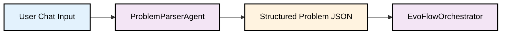
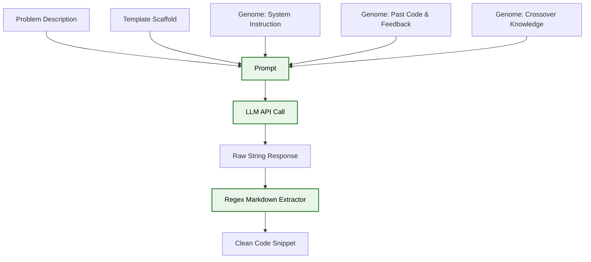
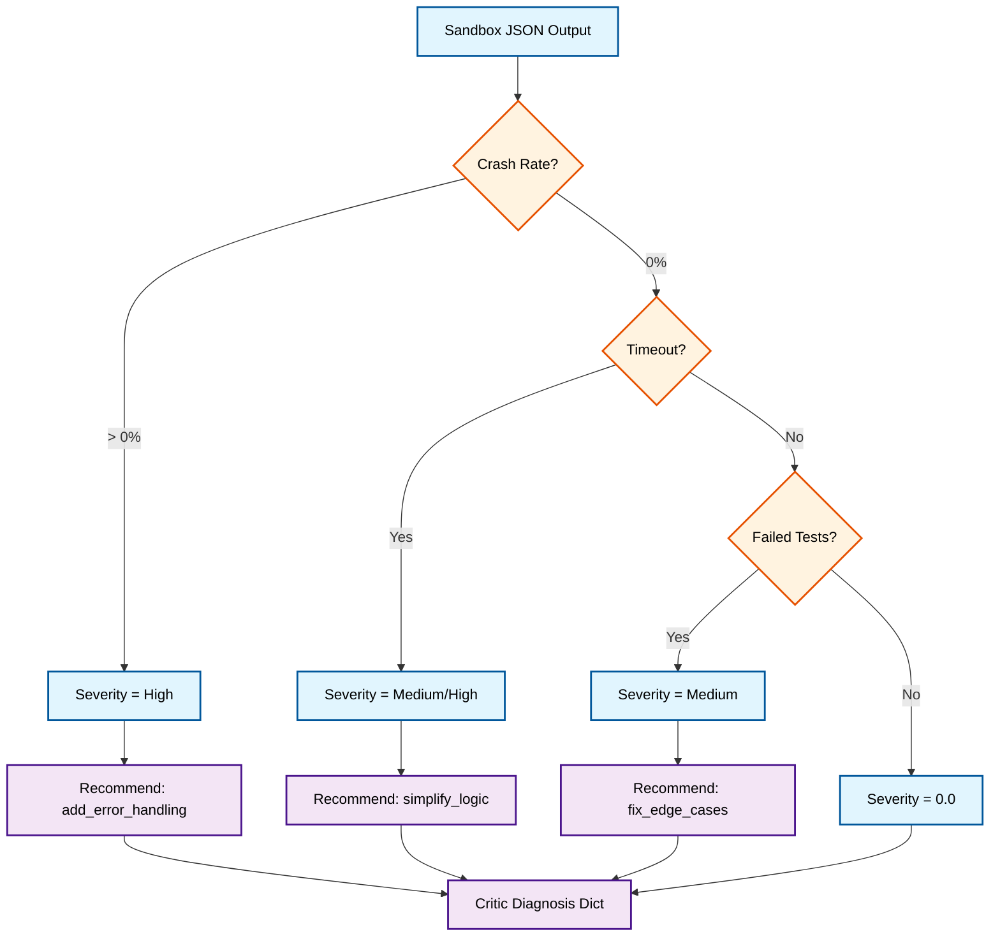

# 🔄 EvoCode Operational Workflow

This document details the step-by-step operational flow of the EvoCode system during a standard generation cycle. It tracks the journey of a single problem definition as it passes through the multi-agent co-evolutionary pipeline and emerges as a validated, optimized piece of code.

---

## 📑 Contents
1. [Initialization Phase](#1-initialization-phase)
2. [Scaffolding Phase (TemplateAgent)](#2-scaffolding-phase-templateagent)
3. [Generation Phase (GeneratorAgent)](#3-generation-phase-generatoragent)
4. [Verification Phase (Tester & Sandbox)](#4-verification-phase-tester--sandbox)
5. [Diagnostics Phase (CriticAgent)](#5-diagnostics-phase-criticagent)
6. [Evolution Phase (Selection & Breeding)](#6-evolution-phase-selection--breeding)
7. [Reporting & Finalization](#7-reporting--finalization)

---

## 🎬 1. Initialization Phase

The workflow begins when the user interacts with the system via `chat.py` or the batch processing script `run_test_eval.py`.

### User Input to Problem Definition


1. **Input:** The user types a natural language query (e.g., "Implement a LRU Cache").
2. **Parsing:** The `ProblemParserAgent` interprets the prompt and uses an LLM to generate a structured JSON object containing a title, description, and an array of static test cases (inputs and expected outputs).
3. **Orchestration:** The `EvoFlowOrchestrator` initializes. It spawns the 4 underlying populations (Generators, Critics, Mutators, Evaluators) with a population size (default `pop_size = 3`). The array of languages mapped to these slots is `["Python", "Java", "C++"]`.

---

## 🏗️ 2. Scaffolding Phase (TemplateAgent)

Before any generation occurs, the system prepares the environment.

1. **Isolated Scaffold Generation:** The `EvoFlowOrchestrator` calls the `TemplateAgent` exactly once per problem.
2. **Language Skeletons:** The TemplateAgent generates syntactically valid code skeletons for Python, Java, and C++.
   - *Example (Java):* `class Solution { public int solve(String input) { // TODO } }`
3. **Injection:** These templates are saved into the problem dictionary. This ensures that the GeneratorAgents focus *only* on algorithmic logic rather than boilerplate syntax, drastically reducing hallucination and compilation errors in strictly typed languages.

---

## ✍️ 3. Generation Phase (GeneratorAgent)

The core loop begins. For each genome in the population, the `GeneratorAgent` attempts to solve the problem.

### The Prompt Construction Flow


1. **Prompt Assembly:** The `GeneratorAgent` reads its `GeneratorGenome`. If the genome specifies `prompt_style = "chain_of_thought"`, it adds instructions for the LLM to think step-by-step.
2. **Context Injection:** If this is generation 2 or later, the genome's `past_code` and `critic_feedback` fields are injected to inform the LLM of previous mistakes.
3. **Execution:** The prompt is sent through the `EvoClient` (utilizing Groq, Ollama, or OpenRouter based on availability).
4. **Extraction:** The raw LLM output is parsed. The system looks for language-specific markdown blocks (e.g., ` ```python `) and extracts the pure source code.

---

## 🛡️ 4. Verification Phase (Tester & Sandbox)

This is the most critical and complex phase, ensuring code safety, preventing hallucinations, and gathering fitness metrics.

### Step-by-Step Verification Sequence
1. **Code Cache Check:** The orchestrator hashes the normalized code string. If this exact code was generated previously, it bypasses execution and immediately loads the cached fitness results, saving immense time and token costs.
2. **Anti-Cheating (`TesterAgent`):** The LLM reviews the code to check if it simply contains hardcoded `if/else` statements matching the known static test inputs. If flagged as cheating, execution stops, and fitness is set to 0.0.
3. **Ephemeral Test Generation (`PropertyTester`):** Generates 5 random, edge-case test inputs (e.g., negative bounds, empty arrays) to append to the static suite.
4. **Docker Execution (`Sandbox`):**
   - The code and JSON test cases are written to a temporary directory.
   - The Python/Java/C++ specific test harness is dynamically concatenated to the source file.
   - A `subprocess` spawns a Docker container (`evocode-sandbox`), mounting the temp directory.
   - The harness executes the tests, capturing telemetry (`time_ms`, `mem_kb`, status).
   - The container exits, and the JSON results are parsed.
5. **LLM Validation (`CodeValidatorAgent`):** Even if the sandbox passed all tests, the Validator LLM performs a logical check for unhandled edge cases not caught by the generated test suite.

---

## 🩺 5. Diagnostics Phase (CriticAgent)

The `CriticAgent` operates on the raw data returned by the Sandbox and Validator. It acts as a diagnostic engine without using LLM API calls (pure rules).



The output is a `diagnosis` dictionary containing the `primary_failure`, `severity`, and an array of `recommended_mutations`.

---

## 🧬 6. Evolution Phase (Selection & Breeding)

Once all agents in the population have been evaluated, scored, and criticized, the `EvoFlowOrchestrator` applies genetic selection.

### 6.1 The Viability Gate
Before any breeding occurs, the population passes through the Viability Gate. Any candidate code that passed **0 tests** (total failure or immediate syntax crash) is eliminated from the breeding pool. They offer no positive signal for the next generation.

### 6.2 Truncation Selection
The remaining viable candidates are sorted by their `fitness` score (`Correctness Rate × Quality Score`). 
EvoCode uses **Truncation Selection**:
- The Top K (usually top 2) candidates are marked as "Survivors" and kept intact for the next generation.
- The bottom candidates are "Killed".

### 6.3 Breeding & Mutation
To fill the killed slots, the `MutatorAgent` breeds new genomes:
1. **Parent Selection:** A survivor is chosen as the parent.
2. **LLM Mutation:** The Mutator Agent feeds the parent's `GeneratorGenome` and the `critic_diagnosis` into an LLM prompt. The LLM modifies parameters (e.g., bumping `reasoning_steps` from 2 to 4, or changing `prompt_style` from `direct` to `test_first`).
3. **Crossover:** The system identifies the absolute best code from the survivor pool (e.g., a perfect Java solution). If the child being bred is meant for the C++ slot, the Mutator injects the Java code into the C++ child's `crossover_instruction`, asking it to translate the underlying algorithm.
4. **Canary Validation:** The `CanaryPipeline` double-checks the proposed genome mutation to ensure the parameter combinations are valid and won't crash the generation engine.

---

## 📊 7. Reporting & Finalization

### Circuit Breaker Check
At the end of the generation, the Orchestrator checks the best fitness. If a solution achieved a 100% pass rate (and survived the LLM Validator), the **Circuit Breaker** triggers. The evolutionary loop halts early, preventing wasted compute on further generations since a perfect solution was already found.

### Structured Logging
All telemetry, genome configurations, raw generated code, test execution traces, and mutation logs are compiled into a massive JSON object.
The `EvoFlowOrchestrator` dumps this file into `structured_reports/ddmmyyyy_hh-mm-ss.json`.

This concludes the workflow for a single problem, and the system is ready to accept the next user input.
